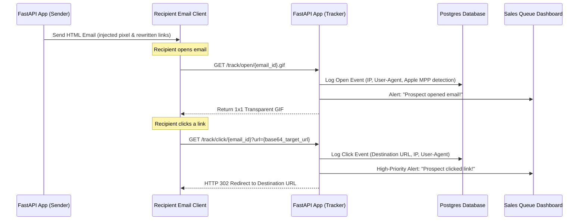

# Email Tracking (Open & Click) Integration Plan (FastAPI)

This plan details how to implement robust email open (read receipt) and link click tracking in your email marketing automation SaaS using **Python FastAPI** and **SQLAlchemy** (or raw SQL). It includes database schemas, FastAPI route handlers, HTML email compilers, and integration with your sales/cold calling dashboard.

---

## 1. FastAPI Architecture Overview



---

## 2. Database Schema (PostgreSQL/MySQL)

```sql
-- Sent emails list
CREATE TABLE sent_emails (
    id VARCHAR(36) PRIMARY KEY, -- Unique ID (UUID4) for each recipient/email
    campaign_id VARCHAR(36),
    recipient_email VARCHAR(255) NOT NULL,
    subject VARCHAR(255),
    sent_at TIMESTAMP DEFAULT CURRENT_TIMESTAMP
);

-- Open events table
CREATE TABLE email_opens (
    id SERIAL PRIMARY KEY,
    email_id VARCHAR(36) REFERENCES sent_emails(id) ON DELETE CASCADE,
    opened_at TIMESTAMP DEFAULT CURRENT_TIMESTAMP,
    ip_address VARCHAR(45),
    user_agent TEXT,
    is_proxy BOOLEAN DEFAULT FALSE -- Detects Apple Mail Privacy Protection
);

-- Click events table
CREATE TABLE email_clicks (
    id SERIAL PRIMARY KEY,
    email_id VARCHAR(36) REFERENCES sent_emails(id) ON DELETE CASCADE,
    clicked_at TIMESTAMP DEFAULT CURRENT_TIMESTAMP,
    target_url TEXT NOT NULL,
    ip_address VARCHAR(45),
    user_agent TEXT
);
```

---

## 3. FastAPI Route Implementation

#### [NEW] [tracking.py](file:///c:/Users/manik/Downloads/ColdCalling%20Strategy/tracking.py)
This router handles the incoming pixel load and redirection clicks.

```python
import base64
from fastapi import APIRouter, Request, Response, status, Query
from fastapi.responses import RedirectResponse
# Assumes you have database session imports, e.g.:
# from database import get_db
# from sqlalchemy.orm import Session

router = APIRouter(prefix="/track", tags=["Email Tracking"])

# 1x1 Transparent GIF binary payload
TRANSPARENT_GIF_BYTES = b'\x47\x49\x46\x38\x39\x61\x01\x00\x01\x00\x80\x00\x00\x00\x00\x00\xff\xff\xff\x21\xf9\x04\x01\x00\x00\x00\x00\x2c\x00\x00\x00\x00\x01\x00\x01\x00\x00\x02\x02\x4c\x01\x00\x3b'


@router.get("/open/{email_id}.gif")
async def track_open(email_id: str, request: Request):
    """
    Serves a transparent 1x1 GIF and logs the open event.
    """
    # 1. Capture Client Data
    user_agent = request.headers.get("user-agent", "")
    ip_address = request.headers.get("x-forwarded-for") or (request.client.host if request.client else "Unknown")
    
    # Clean proxy lists if using a reverse proxy
    if ip_address and "," in ip_address:
        ip_address = ip_address.split(",")[0].strip()

    # 2. Detect Apple Mail Privacy Protection (false positives preloaded by Apple)
    is_proxy = "AppleNewsBot" in user_agent or "CloudImageService" in user_agent

    # 3. Log event to database (Mock DB call - implement your ORM inserts here)
    # db.execute(insert_open_statement, {"email_id": email_id, "ip": ip_address, "ua": user_agent, "is_proxy": is_proxy})
    
    # 4. Trigger alert for your cold call dashboard (only for real human opens)
    if not is_proxy:
        await trigger_realtime_sales_alert(email_id, event_type="open", ip=ip_address)

    # 5. Return the image with aggressive cache-busting headers
    return Response(
        content=TRANSPARENT_GIF_BYTES,
        media_type="image/gif",
        headers={
            "Cache-Control": "no-store, no-cache, must-revalidate, max-age=0, post-check=0, pre-check=0",
            "Pragma": "no-cache",
            "Expires": "0"
        }
    )


@router.get("/click/{email_id}")
async def track_click(email_id: str, request: Request, url: str = Query(..., description="Base64 encoded target URL")):
    """
    Logs the link click event and redirects the recipient to their original target.
    """
    user_agent = request.headers.get("user-agent", "")
    ip_address = request.headers.get("x-forwarded-for") or (request.client.host if request.client else "Unknown")

    if ip_address and "," in ip_address:
        ip_address = ip_address.split(",")[0].strip()

    # 1. Decode Target Destination
    try:
        decoded_bytes = base64.urlsafe_b64decode(url.encode("utf-8"))
        destination_url = decoded_bytes.decode("utf-8")
    except Exception:
        # Fallback if decoding fails
        return Response(status_code=status.HTTP_400_BAD_REQUEST, content="Invalid target link")

    # 2. Log click event in DB
    # db.execute(insert_click_statement, {"email_id": email_id, "url": destination_url, "ip": ip_address, "ua": user_agent})

    # 3. Trigger immediate High-Priority Sales Alert
    await trigger_realtime_sales_alert(email_id, event_type="click", ip=ip_address, extra=destination_url)

    # 4. Perform HTTP 302 redirect to the destination
    return RedirectResponse(url=destination_url, status_code=status.HTTP_302_FOUND)


async def trigger_realtime_sales_alert(email_id: str, event_type: str, ip: str, extra: str = None):
    # This function pushes data to a real-time system (SSE, WebSockets, or webhook)
    # so that your sales reps see it immediately on their call dashboards.
    pass
```

---

## 4. Email HTML Compiler (Outbound Processing)

Before sending the email template, the FastAPI backend parses the HTML, wraps all external links, and appends the tracking pixel at the bottom.

#### [NEW] [compiler.py](file:///c:/Users/manik/Downloads/ColdCalling%20Strategy/compiler.py)
This script uses `BeautifulSoup4` (`pip install beautifulsoup4`) to modify the outgoing HTML safely.

```python
import base64
from bs4 import BeautifulSoup

def compile_trackable_email(raw_html: str, email_id: str, tracking_base_url: str) -> str:
    """
    Wraps links with click-tracking and appends the 1x1 open tracking pixel.
    
    :param raw_html: The original HTML body of the email.
    :param email_id: The unique tracking ID generated for the email.
    :param tracking_base_url: The root domain of your FastAPI tracking router (e.g. 'https://track.saas.com').
    """
    soup = BeautifulSoup(raw_html, "html.parser")
    
    # 1. Rewrite all links
    for link in soup.find_all("a", href=True):
        href = link["href"]
        # Track HTTP/HTTPS links, skip anchors, mailto: or tel: links
        if href.startswith("http://") or href.startswith("https://"):
            # Base64 encode target URL
            url_bytes = href.encode("utf-8")
            base64_url = base64.urlsafe_b64encode(url_bytes).decode("utf-8")
            
            # Rewrite target URL
            link["href"] = f"{tracking_base_url}/track/click/{email_id}?url={base64_url}"

    # 2. Append the tracking pixel at the bottom of the <body>
    pixel_url = f"{tracking_base_url}/track/open/{email_id}.gif"
    pixel_tag = soup.new_tag(
        "img",
        src=pixel_url,
        width="1",
        height="1",
        style="display:none !important;",
        alt=""
    )
    
    if soup.body:
        soup.body.append(pixel_tag)
    else:
        soup.append(pixel_tag)
        
    return str(soup)
```

---

## 5. Integrating with your Dashboard (Cold Calling Reference)

To convert this information into immediate B2B sales action:

1. **FastAPI WebSockets / Server-Sent Events (SSE):**
   * Keep a persistent connection open between your Sales reps' web browser and the FastAPI server.
   * When `trigger_realtime_sales_alert` runs, push a JSON payload:
     ```json
     {
       "event": "prospect_active",
       "email_id": "9b1deb4d-3b7d-4bad-9bdd-2b0d7b3dcb6d",
       "action": "click",
       "details": "Clicked demo link",
       "recipient": "cto@targetcompany.com",
       "phone": "+1-555-0199"
     }
     ```
2. **Sales Dashboard UI:**
   * Build a flashing notification or auto-refreshing "Hot List" cards.
   * Provide a one-click button: **"Call Client"**.
   * Selecting the button launches the SIP softphone configuration (`sip:phone_number` standard protocol link) to trigger an outbound call via your configured MicroSIP client.

---

## Open Questions

1. **Database Library:** Do you use **SQLAlchemy**, **Tortoise ORM**, or raw SQL query executors in your FastAPI backend? I can provide the exact database models if required.
2. **Task Queue:** Are you using **Celery** or **Arq** (redis background workers) to process outbound emails? The compilation of HTML can be run inside these background workers to keep your main FastAPI server fast and non-blocking.
